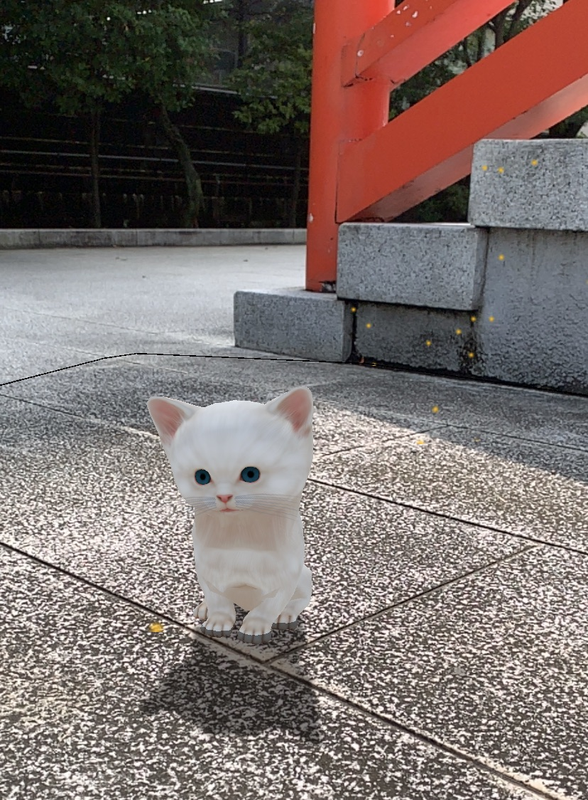

# ARKitten2019
技術評論社の月刊誌Software Designで連載中の「スマホARアプリ開発入門」で開発するサンプルのリポジトリです。

masterブランチには[2020年1月号](http://gihyo.jp/magazine/SD/archive/2020/202001)の記事での完成状態がコミットされています。

## 2020年1月号

### 誌面掲載ソースコードの全文
- [BallControlスクリプトのRaycast対応（差分表示）](https://github.com/ktaka/ARKitten2019/commit/173b30e3cac14699165058992c404b95727bdc6e#diff-d5678ccd00ac1fff0ea8cbb19593cb35)
  - [全体表示](https://github.com/ktaka/ARKitten2019/blob/202001r2/ARKitten/Assets/Scripts/BallControl.cs)

- [BallOperationスクリプトのイベント対応（差分表示）](https://github.com/ktaka/ARKitten2019/commit/173b30e3cac14699165058992c404b95727bdc6e#diff-b6b6d71d3b256e23f6770bb5234920c2)
  - [全体表示](https://github.com/ktaka/ARKitten2019/blob/202001r2/ARKitten/Assets/Scripts/BallOperation.cs)

- [CameraControlスクリプト](https://github.com/ktaka/ARKitten2019/blob/202001r2/ARKitten/Assets/Scripts/CameraControl.cs)

- [PlaceObjectスクリプトに子猫が走る機能を追加する（差分表示）](https://github.com/ktaka/ARKitten2019/commit/f8e4f33e33e0d4e82e449a795dad37f0fbb631e9#diff-edc75b09adb2b481f7fd694404d9495d)
  - [全体表示](https://github.com/ktaka/ARKitten2019/blob/202001r2/ARKitten/Assets/Scripts/PlaceObject.cs)

### 動画解説
- [スマートフォンでの実行時の動画](https://youtu.be/reDrOik5acM)

---

## 2019年12月号

### 誌面掲載ソースコードの全文
- [PlaceObjectのタップ処理を2本指にする（差分表示）](https://github.com/ktaka/ARKitten2019/commit/0b37ae7a57c8994fdf3f9a1fcf6d547c92e4f7bc#diff-edc75b09adb2b481f7fd694404d9495d)
  - [全体表示](https://github.com/ktaka/ARKitten2019/blob/201912r_part_1/ARKitten/Assets/Scripts/PlaceObject.cs)

- [BallControlスクリプト](https://github.com/ktaka/ARKitten2019/blob/201912r_part_1/ARKitten/Assets/Scripts/BallControl.cs)

- [PlaceObjectにRigidbodyによる制御を追加する（差分表示）](https://github.com/ktaka/ARKitten2019/commit/f78edc42b6547c22676b657c7a1f43b60deaf83b#diff-edc75b09adb2b481f7fd694404d9495d)
  - [全体表示](https://github.com/ktaka/ARKitten2019/blob/201912r/ARKitten/Assets/Scripts/PlaceObject.cs)

- [RootMotionにRigidbodyによる制御を追加する（差分表示）](https://github.com/ktaka/ARKitten2019/commit/f78edc42b6547c22676b657c7a1f43b60deaf83b#diff-6db954ca0fb619beaca540bcc60e2a2a)
  - [全体表示](https://github.com/ktaka/ARKitten2019/blob/201912r/ARKitten/Assets/Scripts/RootMotion.cs)

- [BallOperationスクリプト](https://github.com/ktaka/ARKitten2019/blob/201912r/ARKitten/Assets/Scripts/BallOperation.cs)

- [BallControlに子猫が反応するための機能を追加する（差分表示）](https://github.com/ktaka/ARKitten2019/commit/f78edc42b6547c22676b657c7a1f43b60deaf83b#diff-d5678ccd00ac1fff0ea8cbb19593cb35)
  - [全体表示](https://github.com/ktaka/ARKitten2019/blob/201912r/ARKitten/Assets/Scripts/BallControl.cs)

### 動画解説
- [スマートフォンでの実行時の動画](https://youtu.be/iByN_FFv370)

---

## 2019年11月号
[2019年11月号](http://gihyo.jp/magazine/SD/archive/2019/201911)の記事での完成状態は[こちらのブランチ](https://github.com/ktaka/ARKitten2019/tree/201911r)にあります。

### 誌面掲載ソースコードの全文
- [PlaceObjectにアニメーション制御を追加する（差分表示）](https://github.com/ktaka/ARKitten2019/commit/20ea10f2e973e1eb67af021bad706b834350dd6b#diff-edc75b09adb2b481f7fd694404d9495d)
  - [全体表示](https://github.com/ktaka/ARKitten2019/blob/201911r/ARKitten/Assets/Scripts/PlaceObject.cs)

- [RootMotionスクリプト](https://github.com/ktaka/ARKitten2019/blob/201911r/ARKitten/Assets/Scripts/RootMotion.cs)

### 動画解説
- [Animator Controllerを作成する手順](https://youtu.be/jHsp4NLCsUs)
- [プレハブの作成](https://youtu.be/dxLWEPFlESo)
- [スマートフォンでの実行時の動画](https://youtu.be/qD2VeAyYbZI)

---

## 2019年10月号
[2019年10月号](http://gihyo.jp/magazine/SD/archive/2019/201910)の記事での完成状態は[こちらのブランチ](https://github.com/ktaka/ARKitten2019/tree/201910)にあります。

### 誌面掲載ソースコードの全文
- [子猫出現時に向きを変える機能を追加する（差分表示）](https://github.com/ktaka/ARKitten2019/commit/1098dbfb1e70a0830e73e71d0fbd2dabd31488c2#diff-edc75b09adb2b481f7fd694404d9495d)
  - [全体表示](https://github.com/ktaka/ARKitten2019/blob/201910_part1/ARKitten/Assets/Scripts/PlaceObject.cs)

- [カメラの動きに応じて子猫の向きを変える機能を追加する（差分表示）](https://github.com/ktaka/ARKitten2019/commit/5012f8a4f9c3216f31a6c3ccf5dd045a4ba6599a#diff-edc75b09adb2b481f7fd694404d9495d)
  - [全体表示](https://github.com/ktaka/ARKitten2019/blob/201910_part2/ARKitten/Assets/Scripts/PlaceObject.cs)

- [カメラの動きに応じて子猫の向きをアニメーションする機能を追加する（差分表示）](https://github.com/ktaka/ARKitten2019/commit/f22b1f30a967d7a58334c538d027eeb1f8fc980a#diff-edc75b09adb2b481f7fd694404d9495d)
  - [全体表示](https://github.com/ktaka/ARKitten2019/blob/201910/ARKitten/Assets/Scripts/PlaceObject.cs)

### 追加の解説
- [プレイモードで子猫が向きを変える動作を確認する手順](https://youtu.be/C1y0m2BwYNQ)
- [スマートフォンでの実行時の動画](https://youtu.be/t644iFvGyHI)

---

## 2019年9月号
[2019年09月号](http://gihyo.jp/magazine/SD/archive/2019/201909)の記事での完成状態は[こちらのブランチ](https://github.com/ktaka/ARKitten2019/tree/201909)にあります。

### 誌面掲載ソースコードの全文
- [LightEstimationのスクリプト](https://github.com/ktaka/ARKitten2019/blob/201909/ARKitten/Assets/Scripts/LightEstimation.cs)
- [ARShadow.shader](https://github.com/ktaka/ARKitten2019/blob/201909/ARKitten/Assets/Materials/ARShadow.shader)

### 追加の解説
- [光源推定の組み込み手順の動画](https://youtu.be/ooC_l_VHQPc)
- [影（キャストシャドウ）組み込み手順の動画](https://youtu.be/KO2YyDGR5Lk)
- [スマートフォンでの実行時の動画](https://youtu.be/_qIKQdJlpak)

---

## 2019年8月号
[2019年08月号](http://gihyo.jp/magazine/SD/archive/2019/201908)の記事での完成状態は[こちらのブランチ](https://github.com/ktaka/ARKitten2019/tree/201908)にあります。

### 誌面掲載ソースコードの全文
- [PlaceObjectのスクリプト](https://github.com/ktaka/ARKitten2019/blob/201908/ARKitten/Assets/Scripts/PlaceObject.cs)

### 追加の解説
- [Unity HubからのUnityのインストール解説動画](https://youtu.be/BWoLqxWhHUw)
- [スマートフォンでの実行時の動画](https://youtu.be/n6xoIz4smTk)

### ビルドについて
この完成状態のリポジトリをダウンロードしてビルドする際は、Unityのパッケージマネージャーから下記のパッケージのインストールが必要です。
- AR Foundation (version 2.2.0)
- ARCore XR Plugin (version 2.1.0)
- ARKit XR Plugin (version 2.1.0)

---

## Cute Kittenのアセット
このプロジェクトで使用している猫のモデルのアセット（Cute Kitten）は元はUnityのAsset Storeからダウンロード、インポートしていたものです。
アセットの作者の事情によりAsset Storeからはこのアセットはダウンロードできなくなってしまいましたが、このサンプルプロジェクトに含める許可を頂きました。

作者の[Alexey Kuznetsov](http://leshiy3d.com/)氏に感謝します。

Special thanks to [Alexey Kuznetsov](http://leshiy3d.com/), the creator of Cute Kitten.
